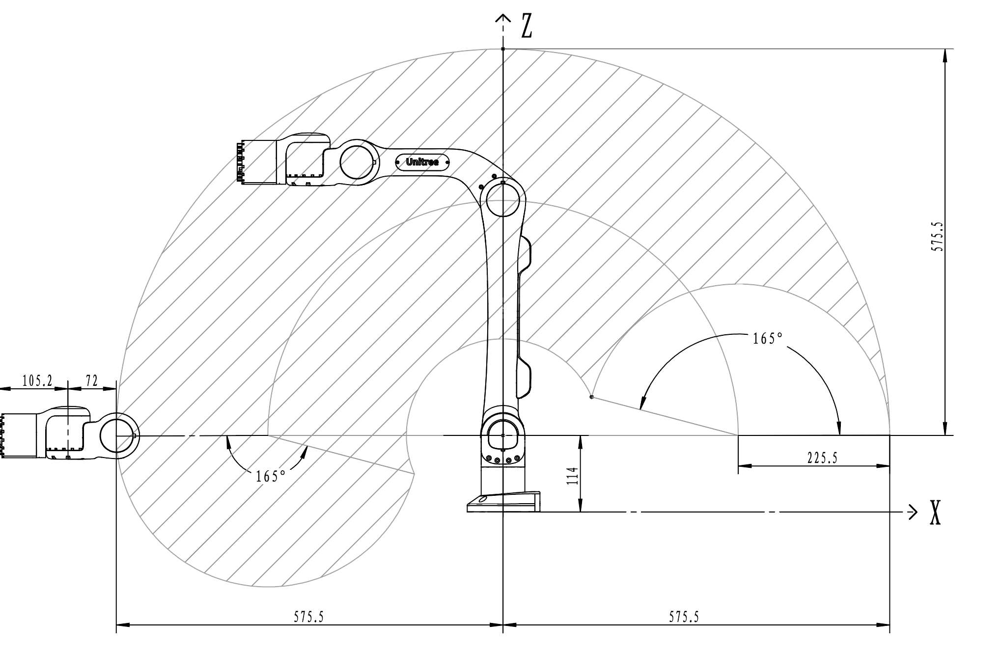
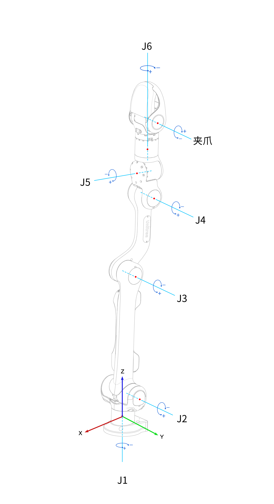
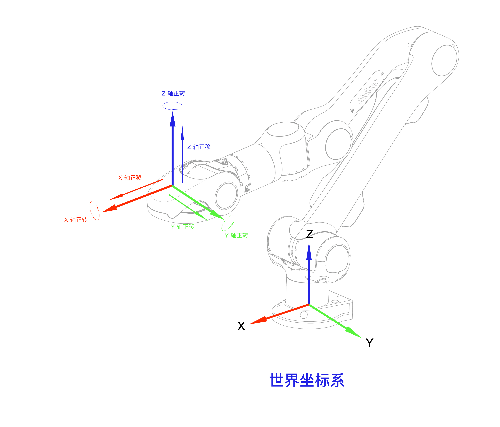

# 规格参数

|型号|Z1|
|:-:|:-:|
|自由度|6轴|
|自重|4.1kg|
|负载|3-5kg|
|最大臂展|700mm|
|重复定位精度|~0.1mm|
|电源需求|电压24V 电流>20A|
|接口|Ethernet|
|用户控制系统|Ubuntu|
|功率|峰值500W|
|力反馈和碰撞检测|有|
|接口控制|位置+力控|

## 机械臂运动范围

## 旋转方向及坐标系

### 关节坐标系

 

z1机械臂关节序号及关节转动正方向定义

 

各关节序号从J1开始，逐个递增至J6。在上图中`+`键表示关节转动的正方向，`-`键表示关节转动的负方向。

|关节|各关节旋转法向|关节坐标|
|:-:|:-:|:-:|
|J1|[0, 0, 1]|[0, 0, 0.0665]|
|J2|[0, 1, 0]|[0, 0, 0.114]|
|J3|[0, 1, 0]|[-0.35, 0. 0.114]|
|J4|[0, 1, 0]|[-0.132, 0, 0.1717]|
|J5|[0, 0, 1]|[-0.06, 0, 0.1717]|
|J6|[1, 0, 0]|[-0.0128, 0, 0.1717]|

### 笛卡尔坐标系

 

笛卡尔空间控制

 

